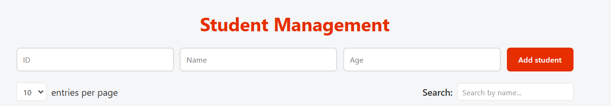

# ITI Student Affairs System (JavaScript)

A modular **Student Affairs Management System** built with **Vanilla JavaScript** following clean architecture principles, object-oriented design, and a service-based approach. The project uses `json-server` as a mock backend and demonstrates real-world CRUD workflows for multiple academic actors.

---

## Features

* Manage **Students**, **Instructors**, **Employees**, and **Courses**
* Full CRUD operations for each actor
* Clean separation of concerns (Models, Controllers, Services, UI)
* Reusable and configuration-driven UI components
* OOP with ES6 classes and inheritance
* RESTful interaction with a mock API

---

## Tech Stack

* JavaScript (ES6+)
* HTML5 / CSS3
* json-server (Mock REST API)
* Modular architecture (ES Modules)

---

## Project Structure

```
ITI-Adv-JS-Project-2/
│
├── server/
│   └── db.json
│
├── src/
│   ├── Actors/
│   ├── controllers/
│   ├── services/
│   ├── UI/
│   ├── utils/
│   ├── appState.js
│   └── main.js
│
├── Pages/
├── styles/
├── package.json
└── README.md
```

---

## Architecture & Design Patterns

### MVC-Inspired Architecture

The project follows an **MVC-inspired structure**:

* **Model** → `Actors/`
* **View** → `UI/`, `Pages/`, `styles/`
* **Controller** → `controllers/`

Each layer has a single responsibility and communicates through clear interfaces.

---

### Service Layer Pattern

All API communication is abstracted into a **Service Layer**:

* `apiClient.js` handles HTTP operations
* Entity services encapsulate endpoint logic

This keeps controllers clean and maintainable.

---

### Object-Oriented Programming (OOP)

* `Person` is a base class
* `Student`, `Instructor`, and `Employee` extend `Person`
* Shared logic is reused via inheritance

---

## Actors

* Student
* Instructor
* Employee
* Course

Each actor has:

* A domain model (class)
* A controller
* A service
* A UI table configuration

---

## API Endpoints

**Base URL**

```
http://localhost:3000
```

### Students

* GET `/students`
* GET `/students/:id`
* POST `/students`
* PUT `/students/:id`
* DELETE `/students/:id`

### Instructors

* GET `/instructors`
* GET `/instructors/:id`
* POST `/instructors`
* PUT `/instructors/:id`
* DELETE `/instructors/:id`

### Employees

* GET `/employees`
* GET `/employees/:id`
* POST `/employees`
* PUT `/employees/:id`
* DELETE `/employees/:id`

### Courses

* GET `/courses`
* GET `/courses/:id`
* POST `/courses`
* PUT `/courses/:id`
* DELETE `/courses/:id`

---
## Screenshots




## How to Run the Project

```bash
npm install
npx json-server --watch server/db.json
```

Then open any HTML file inside the `Pages/` directory using Live Server or a local server.

---

## Learning Outcomes

* Practical MVC architecture in JavaScript
* Service layer abstraction
* Configuration-driven UI rendering
* OOP and inheritance with ES6
* Clean and scalable project structure

---

## Author

**Islam ElSaqqa**

---

⭐ If you find this project useful, feel free to star the repo!
